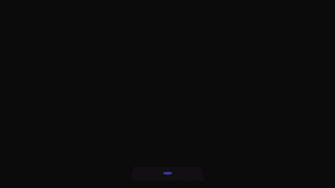

  

   __Hello, I'm Büşra.__ 
<small> Coding in React and JavaScript has become a passion and hobby for me as someone 
who is constantly interested in the evolving world of software. The ever-evolving nature of 
this field excites me. I have a strong desire to explore innovations, improve myself, 
and learn new things. As a diligent, curious, and open-minded individual, I aspire to develop creative projects and prove myself in this field. Coding the ideas of users and satisfying them brings me joy and deepens my love for my work. I blieve my technical skills and passion 
for this field will make a valuable contribution to any team.
I'm excited about the possibilities that the future holds
 and can't wait to see what's coming.</small>

+ 💜  I'm currently working on Mini React Projects by Difficulty Level 
  
+  👉🏻  You can check them out in "my-react-projects" repository 
  
+  🌱  Learning more about React.
  
+  🙃 A fun fact about me: I can't live without 3 C: coding, cats, and coffee.
  

 
<!-- 
       
 -->

  
   
  
  

 
<b>Visitors Count</b>
  

 
 

